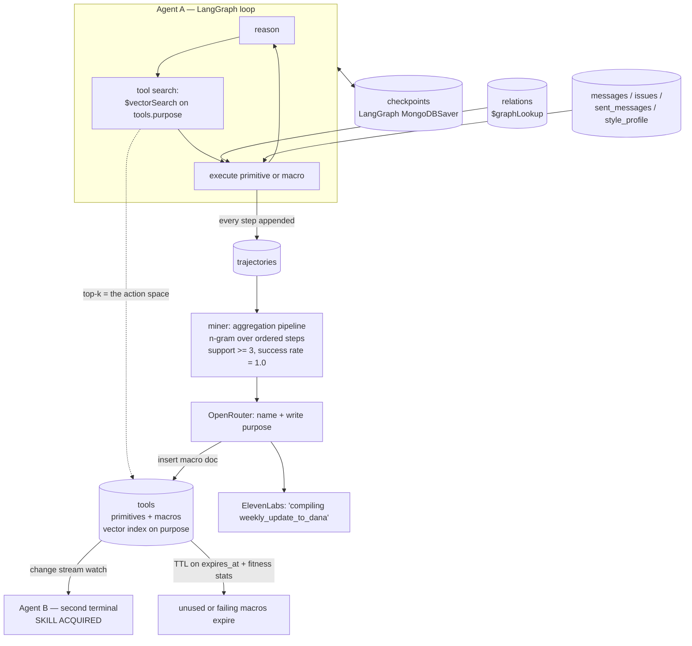

# Perpetual

**An agent whose tool list is not code. It's a `$vectorSearch` result — over a collection the agent writes to itself.**

Every agent you have used ships with a fixed tool list. Someone typed those functions into a file. The agent will have exactly those tools on day 1 and on day 400. It does the same six-step chore every Thursday and it is exactly as slow on the fiftieth Thursday as on the first.

Perpetual removes the file. Tools live in a MongoDB collection. At every reasoning step the agent asks Atlas Vector Search *"what can I do about this?"* and the top-k hits become its action space for that turn. That means the action space is writable — and Perpetual writes to it. A miner reads the agent's own execution logs, finds action sequences that keep repeating and keep succeeding, and compiles them into a new named tool. The agent's tool count goes up while it is running.

Then a second agent, in a second terminal, picks up that tool through a change stream — seconds later, no restart, no deploy.

**Agent A got the experience. Agent B got the skill.**

---

## No Cold Start

The pitch in one line: *the second time should be cheaper than the first, and every other agent should get the discount.*

Today, agent improvement means retraining a model or a human editing a prompt. Both are offline, slow, and centralized. Perpetual does it online and in the data layer:

| | Cold agent | Perpetual, after one afternoon of work |
|---|---|---|
| Weekly update to boss | 6 tool calls, ~25s, ~9k tokens of reasoning | 1 tool call, ~5s, ~600 tokens |
| Where the skill lives | model weights / prompt file | a document in `tools` |
| Sharing it | redeploy | change stream, seconds |
| Wrong skill | ships forever | TTL + fitness counters; it dies |

The unlock is that **skill becomes data**. Data replicates, indexes, expires, and can be inspected on a projector. Weights cannot.

---

## Architecture



### Why each MongoDB feature is load-bearing

Not decoration. Remove any one of these and the demo stops working.

**1. Atlas Vector Search on `tools.purpose` — *the tool list IS a query result***
This is the whole thesis. `tool_search(intent)` runs `$vectorSearch` against `tools.purpose_embedding` with `kind`/`status` filters and returns the top-k tools as the model's function schema for that turn. Because retrieval is the binding mechanism, a newly inserted document is *immediately* a callable tool — no registry reload, no restart, no code. Automated Embeddings keeps `purpose` and its vector in sync on write (Voyage fallback path via `VOYAGE_API_KEY` when the sandbox tier lacks it). We also vector-index `messages.text` so "what did we say about reconciliation" is semantic, not keyword.

**2. Aggregation framework as the miner — *learning is a pipeline***
`trajectories` stores one document per executed step (`run_id`, `step`, `tool`, `params`, `ok`). The miner is an aggregation: `$sort` by step → `$group` per run into an ordered tool array → `$project` sliding n-grams (n = 3..8) → `$unwind` → `$group` by the n-gram with `support` and `success_rate` → `$match` support ≥ 3 and success_rate = 1.0. No ML, no external job runner. Behavior mining is a database query, which is why it can run mid-demo in under a second.

**3. `$graphLookup` over `relations` — *the workplace graph***
People, projects, issues and channels are nodes in `entities`; `relations` holds typed edges (`delegated_to`, `owns`, `reports_to`, `mentioned_in`). `who_did_i_delegate(topic)` is a `$graphLookup` from Maya out through `delegated_to` edges up to depth 3, so "who did I hand the reconciliation work to?" resolves to John Diaz *and* the issue he opened downstream — a multi-hop answer a flat lookup can't give.

**4. Change streams — *skill transfer***
Agent B runs `db.tools.watch([{ $match: { operationType: "insert", "fullDocument.kind": "macro" }}])`. The macro document is fully self-describing (steps + bindings + purpose), so B doesn't fetch code — it receives the tool. On stage, B's terminal prints `SKILL ACQUIRED: weekly_update_to_dana` while A's insert cursor is still warm. This is the moment the demo exists for.

**5. TTL + fitness counters — *bad tools die***
Every macro carries `expires_at` and `stats {invocations, successes}`. Successful use pushes `expires_at` forward; neglect lets Mongo's TTL monitor delete it. A macro whose success rate falls below threshold is demoted to `status: "quarantined"`, which the vector index filters out — it stops being retrievable, therefore stops being a tool. Natural selection over the action space, implemented with an index option.

**6. LangGraph `MongoDBSaver` checkpointer — *durability***
The agent loop is a LangGraph graph checkpointed into `checkpoints` in the same database. Kill the process mid-ritual and it resumes at the step it died on. It also means a run's state, its trajectory, and the tools it learned are all one `mongosh` session away — no second store to reconcile.

### Collections

| collection | what's in it |
|---|---|
| `tools` | 7 primitives + every macro the agent compiles. Vector index on `purpose_embedding`. TTL on `expires_at`. |
| `trajectories` | one doc per executed step; the miner's input |
| `runs` | run outcomes, feeds fitness |
| `entities` / `relations` | workplace graph nodes and edges (`$graphLookup`) |
| `messages` | Slack-export-shaped workplace history, vector-indexed on `text` |
| `issues` | tracker items assigned to / opened by Maya |
| `sent_messages` | Maya's voice corpus — things she actually wrote |
| `style_profile` | distilled tone rules derived from `sent_messages` |
| `checkpoints` | LangGraph state |

### The seven primitives

```
search_slack(query, channel?, limit?)     list_my_issues(state, since_days?)
who_did_i_delegate(topic?)                get_voice_profile()
draft_message(purpose, bullets, voice?)   send_message(to, subject, body)
create_issue(title, body, assignee?)
```

That's the whole hand-written action space. Everything above it, the agent builds.

---

## The macro format

A macro is a **declarative linear step list with `$ref` parameter bindings**. It is readable JSON. There is no code generation and no `exec()` — the executor is ~40 lines that resolve refs and call primitives (`src/perpetual/macro.py`). This matters: a tool an agent wrote is a tool you can read before it runs.

Here is the real document born on stage, compiled from the 6-step ritual Maya keeps doing every Thursday:

```json
{
  "name": "weekly_update_to_dana",
  "kind": "macro",
  "status": "active",
  "purpose": "Compile Maya's weekly status update — recent channel activity, issues she closed, and work she delegated — into a message written in her own voice and send it to her manager.",
  "input_schema": {
    "type": "object",
    "properties": {
      "week": {"type": "string", "description": "e.g. 'this week'"},
      "to":   {"type": "string", "default": "U_DANA"}
    },
    "required": ["week"]
  },
  "steps": [
    {"tool": "search_slack",       "params": {"query": {"$ref": "input.week"}, "limit": 25},        "save_as": "s1"},
    {"tool": "list_my_issues",     "params": {"state": "closed", "since_days": 7},                  "save_as": "s2"},
    {"tool": "who_did_i_delegate", "params": {},                                                    "save_as": "s3"},
    {"tool": "get_voice_profile",  "params": {},                                                    "save_as": "s4"},
    {"tool": "draft_message",      "params": {"purpose": "weekly update for my manager",
                                              "bullets": [{"$ref": "s1.highlights"},
                                                          {"$ref": "s2.issues"},
                                                          {"$ref": "s3.delegations"}],
                                              "voice":   {"$ref": "s4.profile"}},                   "save_as": "s5"},
    {"tool": "send_message",       "params": {"to":      {"$ref": "input.to"},
                                              "subject": "Weekly update",
                                              "body":    {"$ref": "s5.text"}}}
  ],
  "guard": {"$ref": "s4.profile.ready", "equals": true},
  "stats": {"invocations": 0, "successes": 0},
  "born_at": "2026-08-13T16:41:07Z",
  "born_from_run": "run_8f21c",
  "expires_at": "2026-09-12T16:41:07Z"
}
```

`{"$ref": "s2.issues"}` means *"the `issues` field of whatever step `s2` returned"*. Refs resolve against a context dict holding `input` plus each `save_as`; dotted paths walk dicts and list indices. `guard` is an optional precondition — if it fails the macro refuses to run rather than sending a half-built message.

The LLM's only job in compilation is **naming and writing the `purpose`** (via OpenRouter). The *steps and bindings are derived mechanically* from the mined trajectory — which parameter came from which prior step is observed fact, not a guess. That's why this is safe enough to run live.

---

## What is seeded vs live

Being straight about it, because a demo that lies is worthless:

**Seeded (fictional, deterministic):** the entire workplace. Maya Chen, staff engineer at "Northwind Payments"; her manager Dana Okafor (`U_DANA`); John Diaz (`U_JOHN`), whom she delegates to; plus a few more colleagues. `messages` is a **Slack-export-shaped** corpus (same `channel` / `user` / `ts` / `text` / `thread_ts` fields a real `export.json` gives you), `issues` mirror a tracker, `sent_messages` is her voice corpus. **No OAuth, no live Slack, no live GitHub** — a deliberate call for a 3.5-hour build. Swapping in a real Slack export is a **loader change**, not an architecture change: point `perpetual.seed` at the export directory and the same shape lands in the same collection.

**Live (real, happening in front of you):** everything that makes this a project rather than a mockup. Real Atlas cluster. Real `$vectorSearch` retrieval choosing the tool list every turn. Real aggregation mining over the trajectories that were just written. Real macro document inserted at runtime. Real change stream delivering it to a second process. Real TTL and fitness counters. Real LLM calls. Nothing about the learning loop is faked or pre-baked — reset the database and it happens again from zero.

---

## Quickstart

Requires an **Atlas** cluster (Vector Search, change streams and TTL are all Atlas/replica-set features — a standalone `mongod` will not do).

```bash
git clone <this repo> && cd perpetual

uv venv && source .venv/bin/activate
pip install -r requirements.txt
pip install -e .                       # puts src/perpetual on the path

cp .env.example .env                   # MONGODB_URI + OPENROUTER_API_KEY required
                                       # FIREWORKS / ELEVENLABS / VOYAGE optional

python -m perpetual.db                    # create collections + vector indexes, wait until queryable
python -m perpetual.seed                  # load the Northwind Payments workplace + 7 primitives
```

Two terminals, side by side:

```bash
# terminal 1 — the agent that does the work
python -m perpetual.demo agent-a

# terminal 2 — the agent that inherits the skill
python -m perpetual.demo agent-b
```

Terminal 1 runs the ritual cold, mines it, compiles `weekly_update_to_dana`, watches `TOOLS KNOWN` tick 7 → 8, then runs it warm as one call. Terminal 2 never restarts and gains the tool anyway.

```bash
make reset      # drop learned macros + trajectories, keep the seeded workplace
make demo       # reset, pre-warm connections, print the run order
```

---

## Partner tools

- **MongoDB Atlas** — Vector Search, Automated Embeddings, aggregation, `$graphLookup`, change streams, TTL. The substrate, not a datastore.
- **OpenRouter** — the agent's reasoning model, and the namer/purpose-writer at macro compilation.
- **Fireworks** — fast small-model summarization for channel digests and trajectory step labels, where latency matters more than depth.
- **ElevenLabs** — one voice line, at the one moment it earns its place: the agent announcing the tool it just invented.
- **LangChain / LangGraph** — the agent loop, with `langgraph-checkpoint-mongodb` (`MongoDBSaver`) keeping graph state in the same database as everything else.

---

## Honest limits

- Macros are **linear**. No branching, no loops, no parallel steps. Straight-line chores are the 80% case and the format stays auditable.
- Mining needs **support ≥ 3** identical successful sequences. Fewer runs, no compilation — the demo seeds prior runs so the third one fires on stage.
- Parameter bindings are inferred from observed dataflow. A macro that binds wrongly fails its `guard` or its stats, and TTL removes it. That's the safety story: cheap to create, cheap to kill.
- Vector-retrieved tool lists mean **retrieval quality is agent capability**. A bad `purpose` string makes a good tool invisible. This is a real new failure mode and we like that it's a database problem.

---

*Built in one afternoon at the MongoDB .local Build Fest.*
