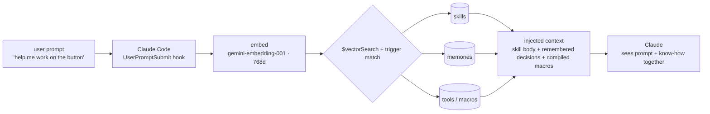
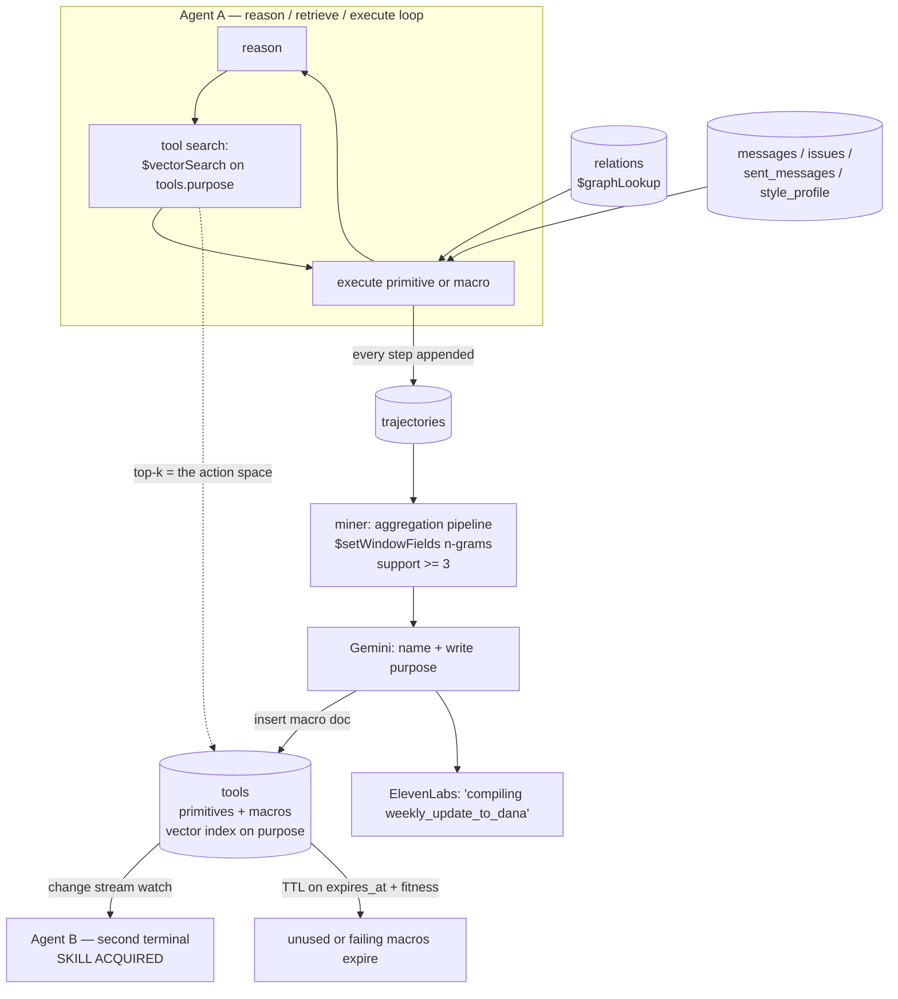

# Perpetual

**An agent whose tool list is not code. It's a `$vectorSearch` result — over a collection the agent writes to itself.**

Every agent you have used ships with a fixed tool list. Someone typed those functions into a file. The agent will have exactly those tools on day 1 and on day 400. It does the same six-step chore every Thursday and it is exactly as slow on the fiftieth Thursday as on the first.

Perpetual removes the file. Tools live in a MongoDB collection. At every reasoning step the agent asks Atlas Vector Search *"what can I do about this?"* and the top-k hits become its action space for that turn. That means the action space is writable — and Perpetual writes to it. A miner reads the agent's own execution logs, finds action sequences that keep repeating and keep succeeding, and compiles them into a new named tool. The agent's tool count goes up while it is running.

Then a second agent, in a second terminal, picks up that tool through a change stream — seconds later, no restart, no deploy.

**Agent A got the experience. Agent B got the skill.**

---

## No Cold Start

The pitch in one line: *the second time should be cheaper than the first, and every other agent should get the discount.*

Today, agent improvement means retraining a model or a human editing a prompt. Both are offline, slow, and centralized. Perpetual does it online and in the data layer:

| | Cold agent | Perpetual, after one afternoon of work |
|---|---|---|
| Weekly update to boss | 6 tool calls, ~25s, ~9k tokens of reasoning | 1 tool call, ~5s, ~600 tokens |
| Where the skill lives | model weights / prompt file | a document in `tools` |
| Sharing it | redeploy | change stream, seconds |
| Wrong skill | ships forever | TTL + fitness counters; it dies |

The unlock is that **skill becomes data**. Data replicates, indexes, expires, and can be inspected on a projector. Weights cannot.

---

## Retrieval is automatic, and it's a vector search

**Nothing about what the agent can do, or how it should do it, is hardcoded. Both are `$vectorSearch` results.**

**The action space is a query.** In the terminal agent this is already true: every reasoning step runs `$vectorSearch` over `tools.purpose_embedding` and the top-k documents *become* the function schema handed to the model for that turn. Primitive *execution* still goes through a small Python registry (`primitives.REGISTRY`); macros are JSON documents run by `macro.execute_macro`. Insert a tool document, it is retrievable — and therefore callable — with no restart.

**Now skills and memories work the same way — and the user never asks for them.** Skills are documents in a `skills` collection with Gemini embeddings. Memories — decisions, specs, conventions the agent was told to remember — live in `memories` the same way. A Claude Code **`UserPromptSubmit` hook** intercepts every prompt *before the model sees it*: embed the prompt with `gemini-embedding-001`, `$vectorSearch` both collections, inject the top matches as context. Type *"help me work on the button"* and the button-design skill plus the stored button spec are simply **already there**. No `load_skill` tool, no `@`-mention, no memory of what exists. The right know-how arrives because the sentence you typed was semantically near it.

**This is not RAG bolted onto a chatbot.** RAG retrieves *reference material* and hands it to a model as reading. Here the retrieval output **is the model's function schema and its operating instructions** — what it *can do* and *how it is supposed to behave* are both decided at query time by a similarity search. And because compiled macros (mined from the agent's own trajectories) are inserted into the very same vector space with the very same embedding model, **a skill the agent invented is retrieved by exactly the same mechanism as one a human wrote**. There is no privileged path for human-authored capability. The learning loop and the retrieval loop are the same loop.



### Vector indexes

| index | collection.field | model | dims | similarity |
|---|---|---|---|---|
| `tools_vec` | `tools.purpose_embedding` | `gemini-embedding-001` | 768 | cosine |
| `memories_vec` | `memories.embedding` | `gemini-embedding-001` | 768 | cosine |
| `skills_vec` | `skills.embedding` | `gemini-embedding-001` | 768 | cosine |
| `messages_vec` | `messages.embedding` | `gemini-embedding-001` | 768 | cosine |

One embedding model, one dimensionality, one distance metric — so tools, skills, memories and workplace history are all comparable objects in one semantic space. Adding a capability to Perpetual means inserting a document.

---

## Architecture



### Why each MongoDB feature is load-bearing

Not decoration. Remove any one of these and the demo stops working.

**1. Atlas Vector Search on `tools.purpose` — *the tool list IS a query result***
This is the whole thesis. `tool_search(intent)` runs `$vectorSearch` against `tools.purpose_embedding` with `kind`/`status` filters and returns the top-k tools as the model's function schema for that turn. Because retrieval is the binding mechanism, a newly inserted document is *immediately* a callable tool — no registry reload, no restart, no code. Embeddings are written client-side with `gemini-embedding-001` (`EMBED_PROVIDER=gemini`), hashed locally for offline demos (`fake`), or left to Atlas Automated Embeddings (`auto`). We also vector-index `messages.embedding` so "what did we say about reconciliation" is semantic, not keyword.

**2. Aggregation framework as the miner — *learning is a pipeline***
`trajectories` stores one document per executed *run* (`steps[]` with `tool`, `args`, `ok`). The miner is an aggregation: `$match` success → `$unwind` steps → `$setWindowFields` sliding n-grams of consecutive tool names (n = 6, then 5, then 4) → `$group` by the window with `support` = distinct trajectories → `$match` support ≥ 3. No ML, no external job runner. Behavior mining is a database query, which is why it can run mid-demo in under a second.

**3. `$graphLookup` over `relations` — *the workplace graph***
People are nodes in `people`; `relations` holds typed edges (`delegated_to`, `asked_help_of`). `who_did_i_delegate(topic)` is a `$graphLookup` from Maya out through those edges up to depth 2, so "who did I hand the reconciliation work to?" resolves to John Diaz *and* anyone he pulled in — a multi-hop answer a flat lookup can't give.

**4. Change streams — *skill transfer***
Agent B runs `db.tools.watch([{ $match: { operationType: "insert", "fullDocument.kind": "macro" }}])`. The macro document is fully self-describing (steps + bindings + purpose), so B doesn't fetch code — it receives the tool. On stage, B's terminal prints `SKILL ACQUIRED: weekly_update_to_dana` while A's insert cursor is still warm. This is the moment the demo exists for.

**5. TTL + fitness counters — *bad tools die***
Every macro carries `expires_at` (a BSON Date, so Atlas TTL can actually delete it) and `fitness {calls, successes}`. Neglect lets Mongo's TTL monitor delete it. Fitness is incremented on every invocation; `status` is a filter field on the vector index, so a later quarantine pass would make a loser unretrievable — and therefore not a tool.

**6. Durability is the trajectory log, not a second graph store**
The agent loop is a Python `for` over tool calls in `src/perpetual/agent.py`. Every step is appended to `trajectories` in the same cluster. LangGraph `MongoDBSaver` is a listed dependency for a later checkpointer — it is not the loop that runs on stage.

### Collections

| collection | what's in it |
|---|---|
| `tools` | 9 primitives + every macro the agent compiles. Vector index on `purpose_embedding`. TTL on `expires_at`. |
| `trajectories` | one doc per executed run (`steps[]`); the miner's input |
| `people` / `relations` | workplace graph nodes and edges (`$graphLookup`) |
| `skills` | operating instructions as documents (`skills_vec`); retrieved by the prompt hook, never called by name |
| `memories` | saved decisions, specs and conventions (`memories_vec`); retrieved the same way |
| `messages` | Slack-export-shaped workplace history, vector-indexed on `embedding` |
| `issues` | tracker items assigned to / opened by Maya |
| `sent_messages` | Maya's voice corpus — things she actually wrote |
| `style_profile` | distilled tone rules derived from `sent_messages` |
| `events` | `tool_born` (and similar) — what Agent B's change stream is watching |

### The nine primitives

```
search_slack(query, channel?, limit?)     list_my_issues(state, since_days?)
who_did_i_delegate(topic?)                get_voice_profile()
draft_message(purpose, bullets, voice?)   send_message(to, subject, body)
create_issue(title, body, assignee?)
save_to_memory(content, topic?)           recall_memory(query, limit?)
```

That's the whole hand-written action space. Everything above it, the agent builds.

---

## The macro format

A macro is a **declarative linear step list with `$ref` parameter bindings**. It is readable JSON. There is no code generation and no `exec()` — the executor is ~40 lines that resolve refs and call primitives (`src/perpetual/macro.py`). This matters: a tool an agent wrote is a tool you can read before it runs.

Here is the real document born on stage, compiled from the 6-step ritual Maya keeps doing every Thursday:

```json
{
  "name": "weekly_update_to_dana",
  "kind": "macro",
  "status": "active",
  "purpose": "Compile Maya's weekly status update — recent channel activity, issues she closed, and work she delegated — into a message written in her own voice and send it to her manager.",
  "input_schema": {"type": "object", "properties": {"note": {"type": "string"}}, "required": []},
  "steps": [
    {"tool": "search_slack",       "params": {"query": "maya work this week", "limit": 8}, "save_as": "s0"},
    {"tool": "list_my_issues",     "params": {"state": "closed", "since_days": 7},          "save_as": "s1"},
    {"tool": "who_did_i_delegate", "params": {},                                          "save_as": "s2"},
    {"tool": "get_voice_profile",  "params": {},                                          "save_as": "s3"},
    {"tool": "draft_message",      "params": {"purpose": "weekly update to dana",
                                             "bullets": ["ledger migration phase 2 done",
                                                         "webhook hardening"]},           "save_as": "s4"},
    {"tool": "send_message",       "params": {"to": "U_DANA",
                                             "subject": "weekly update",
                                             "body": {"$ref": "s4.text"}}}
  ],
  "guard": null,
  "fitness": {"calls": 0, "successes": 0},
  "born_at": "2026-08-13T16:41:07Z",
  "born_from": {"trajectory_ids": ["T-SEED-1", "T-SEED-2", "T-LIVE"], "ngram_hash": "…"},
  "expires_at": "2026-08-20T16:41:07Z"
}
```

`{"$ref": "s4.text"}` means *"the `text` field of whatever step `s4` returned"*. Refs resolve against a context dict holding `input` plus each `save_as`; dotted paths walk dicts and list indices. `guard` is optional — checked as soon as its `$ref` is resolvable, so it can stop a later `send_message` rather than failing before any step runs.

The LLM's only job in compilation is **naming and writing the `purpose`** (via Gemini). The *steps are copied from the mined trajectory*. The one binding we rewrite from observed dataflow is `send_message.body ← draft_message.text`; other args stay as literals from the exemplar run. That's why this is safe enough to run live.

---

## What is seeded vs live

Being straight about it, because a demo that lies is worthless:

**Seeded (fictional, deterministic):** the entire workplace. Maya Chen, staff engineer at "Northwind Payments"; her manager Dana Okafor (`U_DANA`); John Diaz (`U_JOHN`), whom she delegates to; plus a few more colleagues. `messages` is a **Slack-export-shaped** corpus (same `channel` / `user` / `ts` / `text` / `thread_ts` fields a real `export.json` gives you), `issues` mirror a tracker, `sent_messages` is her voice corpus. **No OAuth, no live Slack, no live GitHub** — a deliberate call for a 3.5-hour build. Swapping in a real Slack export is a **loader change**, not an architecture change: point `perpetual.seed` at the export directory and the same shape lands in the same collection.

**Live (real, happening in front of you):** everything that makes this a project rather than a mockup. Real Atlas cluster. Real `$vectorSearch` retrieval choosing the tool list every turn. Real aggregation mining over the trajectories that were just written. Real macro document inserted at runtime. Real change stream delivering it to a second process. Real TTL and fitness counters. Real LLM calls. Nothing about the learning loop is faked or pre-baked — reset the database and it happens again from zero.

---

## Quickstart

Requires an **Atlas** cluster (Vector Search, change streams and TTL are all Atlas/replica-set features — a standalone `mongod` will not do).

```bash
git clone <this repo> && cd perpetual

uv venv && source .venv/bin/activate
pip install -e .                       # deps from pyproject.toml + puts src/perpetual on the path

cp .env.example .env                   # MONGODB_URI + GEMINI_API_KEY required
                                       # ELEVENLABS optional; EMBED_PROVIDER=fake works offline

python -m perpetual.db                    # create collections + vector indexes, wait until queryable
python -m perpetual.seed                  # load the Northwind Payments workplace + 9 primitives
```

Two terminals, side by side:

```bash
# terminal 1 — the agent that does the work
python -m perpetual.agent "send my weekly update to dana"
# same thing: python -m perpetual.demo agent-a

# terminal 2 — the agent that inherits the skill
python -m perpetual.watcher
# same thing: python -m perpetual.demo agent-b
```

Terminal 1 runs the ritual cold, mines it, compiles `weekly_update_to_dana`, watches `TOOLS KNOWN` tick 9 → 10, then runs it warm as one call. Terminal 2 never restarts and gains the tool anyway.

```bash
make reset      # drop learned macros + trajectories, reseed workplace (PYTHONPATH=src)
make warmup     # ping Atlas + each vector index; fails if an index isn't queryable
make demo       # reset, warmup, status, birth-check
make test       # offline unit tests (no Atlas required)
```

---

## Partner tools

- **MongoDB Atlas** — Vector Search, Automated Embeddings, aggregation, `$graphLookup`, change streams, TTL. The substrate, not a datastore.
- **Google Gemini** — `gemini-2.5-flash` is the agent's reasoning model and the namer at macro compilation; `gemini-embedding-001` (768d) embeds tools, skills, memories, messages and every incoming user prompt.
- **ElevenLabs** — one voice line, at the one moment it earns its place: the agent announcing the tool it just invented.

---

## Honest limits

- Macros are **linear**. No branching, no loops, no parallel steps. Straight-line chores are the 80% case and the format stays auditable.
- Mining needs **support ≥ 3** identical successful sequences. Fewer runs, no compilation — the demo seeds prior runs so the third one fires on stage.
- Parameter bindings are inferred from observed dataflow. A macro that binds wrongly fails its `guard` or its fitness counters, and TTL removes it. That's the safety story: cheap to create, cheap to kill.
- Vector-retrieved tool lists mean **retrieval quality is agent capability**. A bad `purpose` string makes a good tool invisible. This is a real new failure mode and we like that it's a database problem.

---

*Built in one afternoon at the MongoDB .local Build Fest.*
